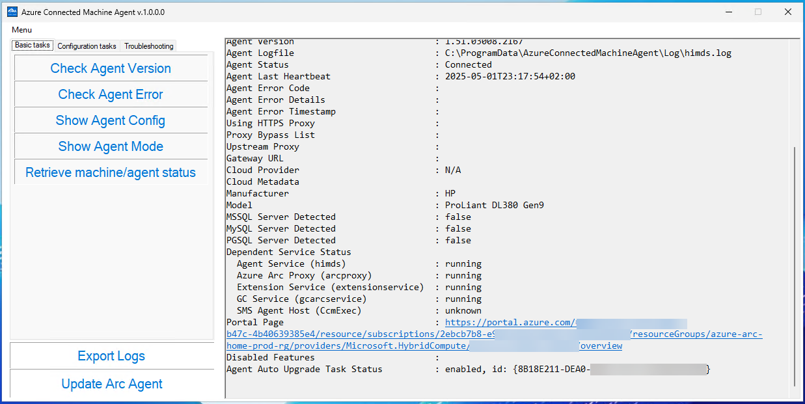

# Azure Arc Agent Toolkit

The Azure Arc Agent Toolkit is a GUI-based application designed to simplify the management of Azure Arc Connected Machine Agents. Built on .NET, this toolkit provides system administrators with an intuitive interface to perform common tasks without relying on the command-line interface (CLI). It is particularly useful for monitoring, configuring, and maintaining Azure Arc-enabled servers.

## 🚀 Features

  - Agent Version Management
    - Check the installed Azure Arc agent version and compare it with the latest available version and update the agent to the latest version if needed.
  - Check Agent errors
    - Check the installed Azure Arc agent for current errors
  - Configuration Management
    - View and modify agent configurations, such as switching between "Full" and "Monitor" modes (more to come)
    - Inspect detailed configuration settings using the "Show Config" feature
  - Log Management
    - Export agent logs to a ZIP file for troubleshooting or archival purposes
    - Select a custom folder to save the logs
  - Service Management
    - Restart the Azure Hybrid Instance Metadata Service (himds) directly from the application
  - Error Diagnostics
    - Retrieve and display detailed error codes, descriptions, and timestamps for troubleshooting
  - Admin Privileges Detection
    - Automatically detects if the application is running with administrative privileges.
    - Enables or disables features based on the user's access level.
  - User-Friendly Interface:
    - Provides a clean and simple interface for performing tasks with minimal effort.
    - Includes status indicators and animations for better user feedback.

## 🚀 How It Works
- The toolkit interacts with the Azure Arc agent using the azcmagent command-line tool under the hood
- It captures and processes the output of commands like show config, logs, and restart service to provide actionable insights
- The application uses asynchronous programming to ensure a responsive user experience, even during long-running operations

## Benefits 👌
- **Ease of Use**: Eliminates the need to memorize CLI commands by providing a graphical interface.
- **Time-Saving**: Automates repetitive tasks like version checks and log exports.
- **Error Handling**: Displays clear error messages and guides users through troubleshooting steps.
- **Centralized Management**: Combines multiple agent management tasks into a single tool.

This toolkit is ideal for administrators managing multiple Azure Arc-enabled servers, offering a streamlined and efficient way to handle day-to-day operations.

## 📌 Prerequisites

- Azure Arc enabled server
- Network connectivity
- Admin rights (for configuration)

## 📌 Requirements

  - Agent Version: Connected Machine Agent version 1.47 or higher is required.
  
  - Operating Systems: The Azure Arc-enabled server’s Operating Systems must be Windows Server 2012 or higher with both Standard/Datacenter editions supported.
  
  - Networking: Connectivity methods supported include Public Endpoint, Proxy, Azure Arc Gateway, and Private Endpoint. No additional endpoints need to be allowed.
  
  - Licensing: The Azure Arc-enabled server must be officially licensed through a valid licensing channel. Unlicensed servers aren't eligible for these benefits. Azure Arc-enabled servers enrolled in Windows Server pay-as-you-go are automatically activated for these benefits.
  
  - Connectivity: The Azure Arc-enabled server must be Connected for management. Disconnected and expired servers aren't eligible. Usage of the included benefits requires connectivity.
  
  - Regions: Activation is available in all regions where Azure Arc-enabled servers has regional availability.
  
  - Environments: Supported environments include Hyper-V, VMware, SCVMM, Stack HCI, AVS, and bare-metal where servers are connected to Azure Arc.

## 📄 How to Use

### 1️⃣ Download the tool

To use the tool, you first need to download the executable (.exe), there is the tool itself.
You can find the executable (.exe) at [https://github.com/enderalci/AACMAToolkit/releases/latest](https://github.com/enderalci/AACMAToolkit/releases/latest) for download (direct to last v.: https://github.com/enderalci/AACMAToolkit/releases/latest/download/AACMAToolkit.exe), and here is the following files avalible under each version tag of the tool (aka releases):

| **File name**        | **Description of the file**                                           |
| -------------------- | --------------------------------------------------------------------- |
| **AACMAToolkit.exe** | **The tool (the file you need to download and run)**                  |
| Source code (zip)    | The soruce code for the specific build (.zip) (auto generated)        |
| Source code (tar.gz) | The soruce code for the specific build (.tar.gz) (auto generated)     |

### 2️⃣ Run the tool

Start the executable file you have downloaded **ACMAToolkit.exe** and start exploring the tool´s features!

---

**Contributions Welcome!** 🤝 Feel free to fork, improve, and submit a PR!

Contact us through LinkedIn or GitHub!

Reference: https://learn.microsoft.com/en-us/azure/azure-arc/servers/azcmagent
